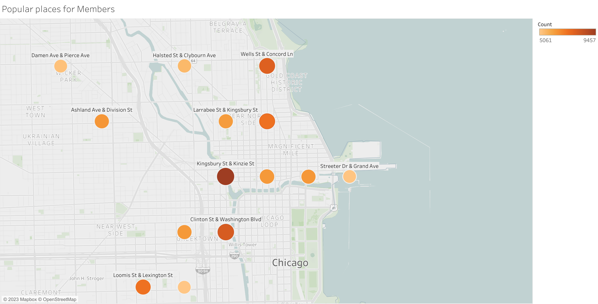

# Case Study: How Does a Bike-Share Navigate Speedy Success?

### About the company
In 2016, Cyclistic launched a successful bike-share offering. Since then, the program has grown to a fleet of 5,824 bicycles that are geotracked and locked into a network of 692 stations across Chicago. The bikes can be unlocked from one station and returned to any other station in the system anytime.
Until now, Cyclistic’s marketing strategy relied on building general awareness and appealing to broad consumer segments.
One approach that helped make these things possible was the flexibility of its pricing plans: single-ride passes, full-day passes,
and annual memberships. Customers who purchase single-ride or full-day passes are referred to as casual riders. Customers
who purchase annual memberships are Cyclistic members.
Cyclistic’s finance analysts have concluded that annual members are much more profitable than casual riders. Although the
pricing flexibility helps Cyclistic attract more customers, Moreno believes that maximizing the number of annual members will
be key to future growth. Rather than creating a marketing campaign that targets all-new customers, Moreno believes there is a
very good chance to convert casual riders into members. She notes that casual riders are already aware of the Cyclistic
program and have chosen Cyclistic for their mobility needs.
Moreno has set a clear goal: Design marketing strategies aimed at converting casual riders into annual members. In order to
do that, however, the marketing analyst team needs to better understand how annual members and casual riders differ, why
casual riders would buy a membership, and how digital media could affect their marketing tactics. Moreno and her team are
interested in analyzing the Cyclistic historical bike trip data to identify trends.

## Ask
Three questions will guide the future marketing program:
1. How do annual members and casual riders use Cyclistic bikes differently?
2. Why would casual riders buy Cyclistic annual memberships?
3. How can Cyclistic use digital media to influence casual riders to become members?


## Prepare
I will use Cyclistic’s historical trip data to analyze and identify trends. I worked with 12 months ([dec 2021-nov 2022](http://divvy-tripdata.s3.amazonaws.com/index.html)) of Cyclistic trip data 
here. (Note: The datasets have a different name because Cyclistic is a fictional company. For the purposes of this case study,
the datasets are appropriate and will enable you to answer the business questions. The data has been made available by
Motivate International Inc. under this [License](https://www.markdownguide.org/cheat-sheet/).


## Process
I'm using python to clean and analyze the data; and Tableau to create visalizations.


### Libraries

```
from pathlib import Path 
import os
from dotenv import load_dotenv
import pandas as pd
import numpy as np
import glob
```


### load and combining the data
`
lista=[pd.read_csv(filename, index_col=None, header=0)for filename in all_files
`
### renaming columns

```
df= pd.concat(lista, axis=0, ignore_index=True).rename(columns={
        "rideable_type": "bike_type",
        "started_at" :"start_date",
        "ended_at": "end_date",
        "member_casual":"customer_type",
        "start_station_name":"start_station",
        "end_station_name":"end_station"
    })
```
 
```` <class 'pandas.core.frame.DataFrame'>
RangeIndex: 5733451 entries, 0 to 5733450
Data columns (total 13 columns):
 #   Column            Dtype  
---  ------            -----  
 0   ride_id           object 
 1   bike_type         object 
 2   start_date        object 
 3   end_date          object 
 4   start_station     object 
 5   start_station_id  object 
 6   end_station       object 
 7   end_station_id    object 
 8   start_lat         float64
 9   start_lng         float64
 10  end_lat           float64
 11  end_lng           float64
 12  customer_type     object 
dtypes: float64(4), object(9)

````
### After checking the data type, the columns with the date need to be formatted with datetime   

```
df.start_date = pd.to_datetime(df.start_date) 
df.end_date = pd.to_datetime(df.end_date) 
```
### Creating new columns from the date to check the trip duration in minutes

```df["start_hour"]=df["start_date"].dt.hour
df["year"]=df["start_date"].dt.year
df["month"]=df["start_date"].dt.month_name()
df["day"]=df["start_date"].dt.day_name()
df["trip_duration"]=(df["end_date"]-df["start_date"]).dt.total_seconds().div(60).astype(float)
```

```
df.columns
Index(['ride_id', 'bike_type', 'start_date', 'end_date', 'start_station',
       'start_station_id', 'end_station', 'end_station_id', 'start_lat',
       'start_lng', 'end_lat', 'end_lng', 'customer_type', 'start_hour',
       'year', 'month', 'day', 'trip_duration'],
      dtype='object')

```
### Droping data we are not going to need. like trips less than 1 min and more than 12 hrs 

```
df["customer_type"].value_counts(dropna=False)
duration_trips=(len(df[df['trip_duration']<=0])) 
duration_trips
index_duration=df[df["trip_duration"]<1].index
index_duration2=df[df["trip_duration"]>720].index
df1=df.drop(index_duration)
df2=df1.drop(index_duration2)
df2.drop(['year','end_lat', 'end_lng'],axis=1,inplace=True)
```
### Exploring data

```
df3=df2.duplicated()
df3.value_counts()

trip_duration=df2.groupby(["trip_duration"]).size().sort_values(ascending=False)
trip_duration.describe
mode_day=df2.groupby("customer_type")["day"].agg(pd.Series.mode)
```

### We can see what is the most popular day for each customer type 
```
customer_type
casual    Saturday
member    Thursday
Name: day, dtype: object
```
```
mode_station_to=df2.groupby("customer_type")["end_station"].agg(pd.Series.mode)
mode_station_from=df2.groupby("customer_type")["start_station"].agg(pd.Series.mode)
ask = pd.to_numeric(df['trip_duration'], errors='coerce').isna()
a=ask.sum()
ask
```
### Most popular starting station for each customer type
```
customer_type
casual     Streeter Dr & Grand Ave
member    Kingsbury St & Kinzie St
Name: end_station, dtype: object
```
# Analysis

```
analysis_time=df2.groupby("customer_type")["trip_duration"].describe()

	        count	    mean	       std	    min	     25%	     50%	    75%	        max
customer
type								
casual	    2292886.0	21.664921	29.232615	1.0 	7.666667	13.316667	24.400000	719.116667
member	    3312861.0	12.510462	14.489064	1.0	    5.316667	9.033333	15.483333	718.216667
------------------------------------------------------------
monthly_totalmin=df2.pivot_table(index='month', columns='customer_type',
                    aggfunc={'trip_duration':"count"})# total min montly                    
	            trip_duration

customer_type	casual	member
month		
April	        123679	239791
August	        350318	417074
December	    68564	174831
February	    20899	92021
January	        18069	83681
July	        396661	407922
June	        360809	391734
March	        87995	190523
May	            274280	347209
November	    98153	231592
October	        203777	341214
September	    289682	395269
monthly_avg=df2.pivot_table(index='month', columns='customer_type',
                    aggfunc={'trip_duration':"mean"}) #average mothly

	trip_duration
customer_type	casual	member
month		
April	        22.652986	11.409234
August	        21.380588	13.268903
December	    17.615504	10.858255
February	    19.089989	11.006201
January	        16.732084	11.065450
July	        23.121400	13.675893
June	        23.217188	13.780582
March	        23.231666	11.688085
May	            25.079277	13.209269
November	    15.311792	10.928824
October	1       8.353181	11.644097
September	    19.884595	12.760785

```
### We can see that casual customers tend to ride longer than members but both types of customers prefer to ride longer in summer.
------------------------------------------------------------
```
Daily_totalmin=df2.pivot_table(index='day', columns='customer_type',
                    aggfunc={'trip_duration':'count'}) #total min dayly

	            trip_duration
customer_type	casual	member
day		
Friday	        332619	466577
Monday	        274142	466879
Saturday	    465434	435047
Sunday	        382843	381447
Thursday	    306705	528799
Tuesday	        257988	507782
Wednesday	    273155	526330

daily_avg=df2.pivot_table(index='day', columns='customer_type',
                    aggfunc={'trip_duration':'mean'}) #average dayly

	                trip_duration
customer_type	casual	    member
day		
Friday	       20.275350	12.296414
Monday	       22.213882	12.083855
Saturday	   24.296288	13.909191
Sunday	       24.743524	13.861517
Thursday	   19.330782	12.134356
Tuesday	       19.423911	11.879120
Wednesday	   18.744969	11.930301
```
### We can see that casual customers like to ride longer on weekends while members are consistent throughout the week. 
------------------------------------------------------------
```
popular_bike=df2.pivot_table(index="bike_type", columns="customer_type", 
            aggfunc={"bike_type":"count"}) 


customer_type	casual	member
bike_type		
classic_bike	882402.0	1702758.0
docked_bike	    176137.0	NaN
electric_bike	1234347.0	1610103.0
------------------------------------------------------------
popular_hours=df2.pivot_table( index="start_hour", columns="customer_type", 
aggfunc={"start_hour":"count"})
hourly_ticks = np.arange(24)
	start_hour
customer_type	casual	member
start_hour		
0	            45582	35465
1	            29606	21841
2	            18422	12609
3	            10891	7859
4	            7511	8817
5	            12274	32272
6	            28908	89787
7	            50741	170496
8	            68648	202208
9	            71442	142995
10	            92337	135038
11	            120373	161706
12	            143128	186719
13	            149304	185748
14	            158807	184150
15	            176112	219946
16	            195250	288604
17	            216922	345019
18	            194494	281233
19	            148903	203406
20	            110118	142983
21	            94265	111883
22	            85317	85832
23	            63531	56245
```
## Share
Average Daily minutes ride  |  Total Daily minutes ride
:-------------------------: |:-------------------------:
   |  

### The data in the graph indicates that casual users tend to utilize the service for longer durations and primarily on weekends, while members exhibit a higher frequency of usage during weekdays and average usage remains consistent throughout the week.
--------------------------------------------------------------------------------------------------------------------
<br/><br/>


### The accompanying graphic illustrates the preferred bike type among two distinct customer segments. As depicted, classic bikes are the most favored choice among members, while electric bikes are the preferred option for casual riders.
--------------------------------------------------------------------------------------------------------------------
<br/><br/>


### The accompanying graphic illustrates the daily behavior patterns of casual customers and member customers. As shown, both segments exhibit a peak in activity at 5 PM. This suggests that this time of day may be an optimal window for targeted marketing efforts or customer engagement.
--------------------------------------------------------------------------------------------------------------------
<br/><br/>
Average Monthly minutes ride  |  Total Monthly minutes ride
:-------------------------:   |:-------------------------:
   |  


### The graph illustrates that casual and member users show an increase of utilizing the service during the summer months,while the casual users have a significant decreasing in usage throughout the rest of the year.  
--------------------------------------------------------------------------------------------------------------------
<br/><br/>

Average Daily minutes ride       |  Total Daily minutes ride
:-------------------------:      |:-------------------------:
  |  

<br/><br/>
### This visualization show us the popular places for member and casual riders. 
--------------------------------------------------------------------------------------------------------------------

## ACT

The data analysis revealed distinct trends and behaviors among casual customers that can aid in the development of a marketing plan. Specifically, casual customers tend to ride for longer periods of time, averaging 20 minutes per day, compared to members who ride for an average of 13 minutes per day. Casual customers also prefer riding on weekends, while members prefer riding on Tuesdays to Thursdays. Furthermore, casual customers tend to prefer electric bikes, while members tend to prefer classic bikes.

Based on these findings, we assume that members are more likely to use bikes for transportation to work or for daily routines because their riding patterns are more consistent and the popular places they ride to are not necessarily tourist areas. On the other hand, casual customers tend to exhibit more drastic changes in their riding patterns, with an increase in average ride time, particularly on weekends and during the summer months. This suggests that casual customers are more likely to be interested in exploring tourist destinations or attending events on weekends and during seasonal events.

### Recomendations

In order to capitalize on these findings, we recommend developing a marketing campaign that focuses on the most popular areas for casual customers. Specific strategies that can be implemented include offering special discounts to become a member or to ride on weekends during the summer, partnering with museums, hotels, convention centers, event venues, and companies that organize weekend events, and offering special discounts to employees of companies in the areas where members tend to ride.

# Google_Bike_Case_Study
